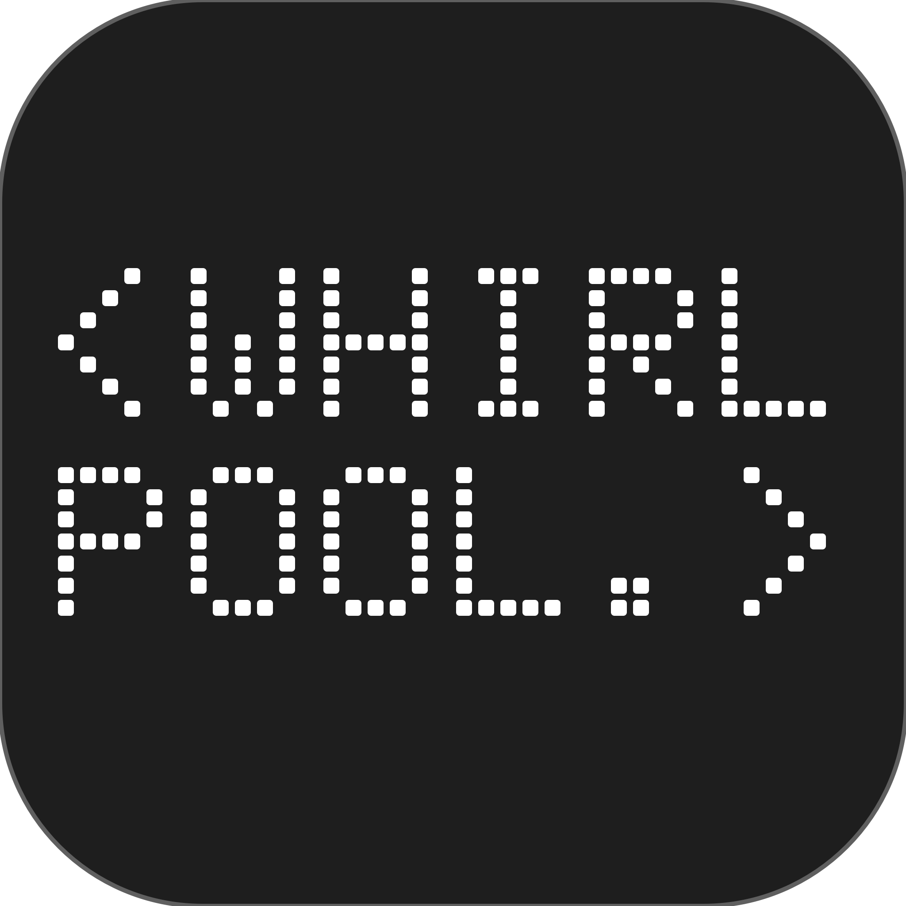

<p align="center">
  
</p>

<h1 align="center">Whirlpool 涡状星系</h1>

<p align="center">
  <b>A LED stock ticker that lives in your macOS menu bar.</b><br>
  Seamless scrolling quotes · dock-side pixel board · bottom bar for rotated displays.<br>
  Free key-less data: Yahoo + Tencent. No subscription, no telemetry.
</p>

<p align="center">
  <a href="LICENSE"></a>
  
  
  
  <a href="README.zh-CN.md"></a>
</p>

---

<p align="center">
  
</p>

[简体中文](README.zh-CN.md) · English

A quiet desktop ticker for your watchlist. Whirlpool displays a scrolling LED ticker and a compact quote board, with price changes highlighted from the highest changed digit through the end of the price.

## Platforms

| | macOS | Windows (preview) |
|---|---|---|
| System integration | Menu bar + floating ticker + quote board | Notification-area icon + floating ticker + quote board |
| Language | English / Simplified Chinese / system default | same |
| Quotes | Yahoo Finance / Tencent, or clearly labeled demo data | same |
| Display | LED dots or system-font ticker with three sizes; pixel or system-font board; intraday chart | LED ticker; native board |
| Light / dark | Per surface (menu bar, floating ticker, board) | Follows the Windows app mode, or fixed light/dark |
| Watchlists, precision, holidays, updates | Yes | Yes |
| Minimum system | macOS 13 | Windows 10/11 x64 (self-contained, no .NET install) |


## Use

On macOS, open `Whirlpool.app`. Right-click the menu-bar ticker, floating ticker, or quote board for **Settings…**. Left-click the menu-bar icon to pause/collapse or resume. Drag floating windows to position them. A small menu-bar icon remains available in board-only mode. Settings are grouped into **Watchlist**, **Display**, and **General**; changes apply after **Save**, while **Cancel** leaves them untouched.


Colors follow the surface they are drawn on: symbols and prices are white on a dark menu bar and near-black on a light one, and red/green switch to darker, contrast-checked shades on light backgrounds (**Display → Colors**: Adaptive, Monochrome, Amber, Green). The floating ticker can sit on a glass capsule so it stays readable over light windows. Hover over a ticker to pause it; double-click a board row (or use **Open Chart** in the menu) to open TradingView/Yahoo.

Scrolling is GPU-composited: each round is rendered once and Core Animation moves it at the display refresh rate, so the app itself stays near 0% CPU while scrolling.

Pick the screen for the floating ticker and board in **Display → Screen** (macOS mirrors the menu bar ticker to every screen's menu bar; its width is sized for the chosen screen). **Lock Floating Windows** stops accidental drags, and **Click Through Floating Ticker** lets clicks reach the windows underneath — both are in the right-click menu of the menu bar icon and in Settings.

Keep several named watchlists and switch them from the menu (**Watchlists**), by Option-clicking a ticker, or with `whirlpool --list NAME`. Price precision is automatic per instrument (FX 4 decimals, A-share ETFs 3, low-priced crypto more) and can be set per symbol in the Watchlist tab.

On Windows, run `Whirlpool.exe` (no installer). Right-click the notification-area icon, the ticker or the board for the menu; double-click the icon for Settings. Ctrl-click the ticker to switch watchlists; double-click a board row to open its chart. Settings live in `%APPDATA%\Whirlpool\config.json` (settings from the Pinwheel era are copied over once).

Choose your data source in General. Demo prices are simulated and identified in the status menu. Symbols include `AAPL`, `^GSPC`, `600519`, `00700`, and `BTC-USD`. Stock symbols must be unique. Mainland China codes use six digits; Hong Kong codes use one to five digits and are left-padded for requests.


### Refreshing and rate limits

The default refresh interval is **30 seconds**. All displays share one cached snapshot and one in-flight fetch. The configured interval is the minimum delay between completed fetches, not a promise of streaming market data. Scrolling continues independently; the ticker adopts updated data at its next cycle. A manual refresh does not bypass provider backoff or the five-second minimum between attempts.

Yahoo requests are per symbol. Four symbols every five seconds would be approximately **48 requests/minute / 2,880 per hour**, before retries or other apps sharing the same IP. With **Refresh slowly while all watched markets are closed** (on by default), Whirlpool stretches the interval while every watched market is outside its session — using exchange calendars with holidays and half days (NYSE rules; China A-share and HKEX tables for the published years; crypto, futures and FX count as always open) — and resumes at the next open. A market whose latest trade is under five minutes old always counts as open. Fetching and scrolling also pause while the screens sleep. There is no fixed public allowance that Whirlpool can guarantee. Short intervals can trigger HTTP 429 even if they worked previously. Whirlpool retains the latest known prices, merges partial results, honors `Retry-After`, and backs off from 30 seconds up to 15 minutes on repeated failures. The menu shows unavailable/stale/rate-limited state and the last successful update time. Data may be delayed by its provider or market.

Whirlpool uses native HTTP requests to public Yahoo/Tencent endpoints; it does **not** depend on Python or yfinance. The [yfinance project](https://ranaroussi.github.io/yfinance/) uses related Yahoo endpoints and [handles HTTP 429](https://github.com/ranaroussi/yfinance/blob/main/yfinance/data.py); it is not an official Yahoo service. The application's GPL-3.0 license does not grant rights to redistribute market data. Review each provider's applicable terms for your use.

## Build

### macOS

Requires Swift 5.7+ and Apple Command Line Tools or Xcode.

```sh
swift build
.build/debug/whirlpool
bash tools/test-price-flash.sh
bash build-app.sh
# Optional universal app (Apple Silicon + Intel):
bash build-app.sh --arch arm64 --arch x86_64
```

The app is locally ad-hoc signed. Developer ID signing/notarization requires the maintainer's own Apple credentials and is not supplied by this repository.

### Windows

Requires the .NET 10 SDK (it cross-compiles from macOS or Linux; running the UI requires Windows).

```sh
cd Windows
dotnet run --project Whirlpool.Core.Tests          # platform-independent checks
dotnet publish Whirlpool.Windows -c Release -r win-x64 --self-contained true \
  -p:PublishSingleFile=true -p:IncludeNativeLibrariesForSelfExtract=true \
  -p:EnableCompressionInSingleFile=true -p:DebugType=none -o ../dist/windows-x64
```

On Windows, `Whirlpool.exe --smoke-test` builds every window in both languages and themes. See [docs/WINDOWS-TESTING.md](docs/WINDOWS-TESTING.md) for the acceptance checklist.


## Configuration and privacy

- macOS: `~/.config/whirlpool/config.json` (the existing path is retained for upgrades).
- Update check: once a day one anonymous request to `api.github.com` for the latest release (turn off in **General → Check for updates automatically**). Nothing is downloaded automatically.
- No account, telemetry, analytics, or cloud sync. Watchlists/settings stay on the device. Requested symbols and network metadata are sent to Yahoo/Tencent when using live data. Demo mode makes no quote requests.
- Saving is atomic. Missing fields receive defaults; malformed files are not silently replaced on startup. No private watchlist/configuration is included in this repository.
- Use **Advanced → Show Configuration File…** on macOS  for the file location.

## macOS CLI

The application binary is also a local client:

```sh
whirlpool --settings
whirlpool --status
whirlpool --send 'TEXT'
whirlpool --urgent 'TEXT'
whirlpool --very-urgent 'TEXT'
whirlpool --standby 'TEXT' --duration 10
whirlpool --width 30
whirlpool --mode marquee|board|bar|marquee,board|marquee,bar
whirlpool --list NAME|N|next|prev
whirlpool --clear
whirlpool --restart
whirlpool --quit
```

Messages support `\c[green]` / `\c[]` colors, `\p[3]` pauses, and `\b[1:green]` / `\b[0]` suffix pulses. The socket is per-user at `/tmp/whirlpool-<uid>.sock`, restricted to that user. `--on-click` intentionally executes a local shell command; use only commands you trust. The CLI is not a network service.

`--status` prints the pid, version, whether the menu bar item is actually visible (macOS hides status items that do not fit next to a long app menu — lower **Display width** if it disappears) and the live scroll positions. Launches and exits are logged with their reason: `log show --last 1d --predicate 'subsystem == "local.whirlpool"'`.

The app runs as a menu-bar agent and shows no Dock icon by default — **Settings → General → "Show Dock icon"** gives you a visible handle (right-click to quit). From a terminal, the bundled binary works directly: `/Applications/Whirlpool.app/Contents/MacOS/whirlpool --status | --restart | --quit`, or hard-reset with `pkill -x whirlpool && open -a Whirlpool`.

## Project

- [Changelog](CHANGELOG.md)
- [Contributing, translations, and releases](CONTRIBUTING.md)
- [Security policy](SECURITY.md)
- [Architecture](docs/ARCHITECTURE.md)
- [Original renderer notes](TECHNICAL.md)
- [License](LICENSE) and [attribution](ATTRIBUTION.md)

Built on the MIT-licensed [rhsev/ticker](https://github.com/rhsev/ticker) display engine. Original copyright notices are retained.

## License & Attribution

Code: **GPL-3.0-only** (see [LICENSE](LICENSE)). The LED renderer derives from
[rhsev/ticker](https://github.com/rhsev/ticker) by Ralf Hülsmann — MIT, retained
in [LICENSE-MIT](LICENSE-MIT) per its terms.

App icon, product name and documentation: **CC BY-NC-SA 4.0** — forks and media
coverage are welcome, but keep the attribution; do not rebrand or monetize the
artwork. See [NOTICE.md](NOTICE.md).

> 转载 / 二次开发请保留本行出处:Project **Whirlpool 涡状星系** by
> [NexusKFK](https://github.com/NexusKFK) · github.com/NexusKFK/whirlpool
