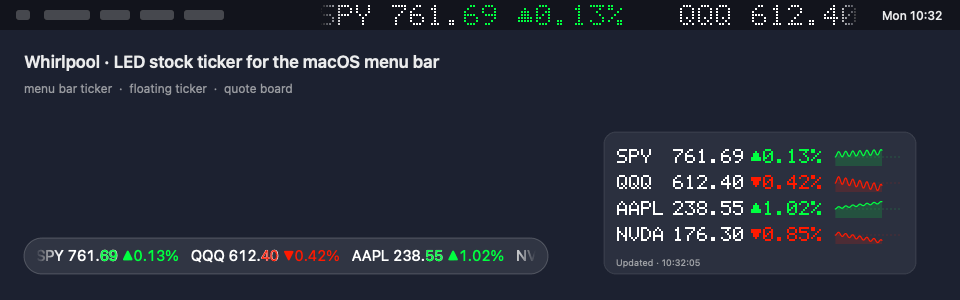

# WP行情带 · Whirlpool

简体中文 · [English](README.md)

<p align="center">
  
</p>

一个轻量的桌面自选行情工具：LED 跑马灯、浮动行情条、紧凑报价卡，以及贴在屏幕边缘的行情组件。

## 平台

| | macOS | Windows（预览版） |
|---|---|---|
| 系统入口 | 菜单栏、浮动行情条、报价卡 | 任务栏通知区域图标、浮动行情条、报价卡 |
| 语言 | 中文 / 英文 / 跟随系统 | 同左 |
| 行情 | Yahoo / 腾讯，或明确标注的模拟行情 | 同左 |
| 显示 | LED 点阵或系统字体跑马灯，三档字号；像素或系统字体报价卡；分时图 | LED 跑马灯；原生报价卡 |
| 布局 | 独立显示卡片、桌面预览、边缘锚点或自由位置；菜单栏宽度独立 | 行情条/报价卡卡片、桌面预览、边缘锚点或自由位置 |
| 亮 / 暗 | 按显示面各自适应（菜单栏、浮动条、报价卡） | 跟随 Windows 应用模式，或固定浅色/深色 |
| 多自选池、小数位、节假日、更新提示 | 支持 | 支持 |
| 系统要求 | macOS 13 及以上 | Windows 10/11 x64（自包含，无需安装 .NET） |


## 使用

macOS：打开 `Whirlpool.app`，右键菜单栏、行情条或报价卡 → **设置…**。左键菜单栏图标可暂停/收起与继续；关闭菜单栏行情显示后仍保留一个小菜单栏入口。

Whirlpool 2.0 的 macOS 设置使用 **自选股 / 布局 / 外观 / 通用** 四页侧栏，以图形卡片选择显示区域、位置、字体与配色。Windows 使用 **布局 / 外观 / 自选股 / 通用** 四个标签页。

Windows：直接运行 `Whirlpool.exe`（免安装）。右键任务栏通知区域图标、行情条或报价卡弹出菜单，双击图标打开设置；Ctrl + 单击行情条切换自选池，双击报价卡某行打开图表。配置在 `%APPDATA%\Whirlpool\config.json`（Pinwheel 时期的配置会自动复制过来一次）。Windows 仍为预览版，实机验收项目见 [Windows 验收清单](docs/WINDOWS-TESTING.md)。

### 位置与宽度

- 在 **布局** 页分别开关显示卡片。macOS 可组合菜单栏行情、浮动行情条与报价卡；Windows 可组合浮动行情条与报价卡，至少保留一个显示区域。
- 选择显示器，再选浮动行情条的六个锚点：顶部或底部，靠左、居中或靠右。位置按可用桌面区域计算，避开 Dock、菜单栏或 Windows 任务栏，并保留少量边距。直接拖动真实行情条会切到 **自由位置**；重新选择锚点即可贴回相应边缘。
- 浮窗宽度按 **20–100% 可用屏宽** 调节，提供 **¼ / ½ / ⅔ / 铺满** 预设，也可拖动真实行情条两端缩放。居中与自由位置保持中心向两边伸缩；靠左或靠右时保持对应边缘。铺满仍保留边距，字号不再承担调整窗口宽度的作用。
- macOS 的 **菜单栏宽度** 独立设置，以 pt 为单位。macOS 在各屏菜单栏镜像同一状态项，共用一个宽度；Whirlpool 按所选屏幕（自动时为主屏）宽度的 40% 封顶。菜单栏拥挤时系统仍可能隐藏它，此时调小这项即可。

桌面预览只修改设置草稿：可以拖动预览中的行情条和两端，**保存**后应用，**取消**不改动正在运行的布局或已保存配置。直接拖动、缩放真实浮窗则立即生效并记住位置。升级保留旧自选股及兼容的浮窗位置、宽度；主动调整宽度控件后，相应显示面才改用新的独立宽度设置。

**锁定浮窗位置** 防止误拖和缩放；**浮动行情条点击穿透** 让鼠标点到下面的窗口，需要操作行情条时可从菜单栏或托盘图标关闭。所选显示器也决定报价卡的默认位置；布局页可以重置两个浮窗的位置。

### 外观与自选股

macOS 配色跟随所在显示面的明暗：暗色菜单栏上代码/价格为白色，亮色菜单栏上为近黑色；红绿涨跌色在亮底自动换成对比度达标的深色版（**外观 → 配色**：自适应、单色、琥珀、绿色）。浮动行情条可选毛玻璃胶囊背板；Windows 在 **外观** 页提供跟随系统、浅色、深色主题卡片。鼠标悬停在行情条上会暂停滚动；双击报价卡某一行（或菜单 **打开图表**）打开 TradingView / Yahoo 图表。

macOS 滚动由 GPU 合成：每轮行情只绘制一次，Core Animation 按屏幕刷新率推进，滚动时 app 自身 CPU 接近 0%。

可建多套自选池，在菜单 **自选池**、macOS ⌥ 单击行情条、Windows Ctrl + 单击行情条或 macOS `whirlpool --list 名称` 快速切换。价格小数位按品种自动决定（外汇 4 位、A 股 ETF 3 位、低价加密资产更多），也可在自选页逐个指定。

代码示例：`AAPL`、`^GSPC`、`600519`、`00700`、`BTC-USD`。同一代码不能重复。A 股使用六位代码，港股一至五位代码会在请求时向左补零。演示源使用模拟价格，状态菜单会明确标注。

## 刷新与限流

默认建议 **30 秒**。所有显示共用缓存和一次进行中的行情请求。配置值表示两次完整拉取之间的最短间隔，不代表交易所逐笔行情。滚动独立运行，跑马灯在下一轮采用新数据；手动刷新也不能绕过限流等待或五秒的最短请求间隔。

开启 **自选市场全部休市时放慢刷新**（默认开启）后，所有自选市场都休市时会放慢拉取，到下一次开盘自动恢复。休市按交易所日历判断，含节假日与半日市（美股按 NYSE 规则推算；A 股、港股按已公布年份的官方休市表；加密资产、期货、外汇视为全天交易）；某市场最近一笔成交在 5 分钟内则一律视为开市。屏幕休眠时也会暂停拉取与滚动。

新版本提示：每天向 `api.github.com` 匿名查询一次最新发布（可在 通用 → 自动检查更新 关闭），不会自动下载或替换 app。

Yahoo 按标的逐个请求。四只股票每五秒拉一次，约为 **48 次/分钟、2880 次/小时**，尚未计入重试或同一 IP 下的其他软件。没有可保证的固定免费额度，五秒不能保证不被限流。遇到失败时保留最近报价、合并部分成功结果，HTTP 429 时遵循 `Retry-After`；连续失败从 30 秒递增退避，最高 15 分钟。失败股票单独计算重试时间，不拖慢正常股票；全部失败或 HTTP 429 时仍对共享行情请求退避。菜单会显示连接失败、部分行情不可用、被限流等状态和最近成功更新时间。数据可能受提供方或市场规则影响而延迟。

Whirlpool 使用原生 HTTP 请求访问 Yahoo/腾讯公开端点，**不依赖 Python 或 yfinance**。[yfinance](https://ranaroussi.github.io/yfinance/) 使用相关 Yahoo 接口，也会[处理 HTTP 429](https://github.com/ranaroussi/yfinance/blob/main/yfinance/data.py)，并非 Yahoo 官方服务。软件采用 GPL-3.0 协议，不代表同时取得了行情数据再分发权；数据使用遵循提供方条款。

## 从源码构建

macOS 需要 Swift 5.7+ 及 Command Line Tools 或 Xcode：

```sh
swift build
.build/debug/whirlpool
bash tools/test-price-flash.sh
bash build-app.sh
# 可选：Apple Silicon + Intel 通用包
bash build-app.sh --arch arm64 --arch x86_64
```

构建产物位于 `.build/apps.noindex/Whirlpool.app`，安装到 `/Applications/Whirlpool.app` 后启动安装版；开发副本放在不参与应用搜索的目录中。应用包和发布压缩包不提交到 Git。

应用采用本地 ad-hoc 签名；Developer ID 签名与公证需要维护者自己的 Apple 凭据。

Windows 需要 .NET 10 SDK，可从 macOS/Linux 交叉编译，运行界面仍需 Windows：

```sh
cd Windows
dotnet run --project Whirlpool.Core.Tests
dotnet publish Whirlpool.Windows -c Release -r win-x64 --self-contained true \
  -p:PublishSingleFile=true -p:IncludeNativeLibrariesForSelfExtract=true \
  -p:EnableCompressionInSingleFile=true -p:DebugType=none -o ../dist/windows-x64
```

在 Windows 上运行 `Whirlpool.exe --smoke-test` 可检查双语、明暗主题下的窗口创建及基础交互；仍需按 [Windows 验收清单](docs/WINDOWS-TESTING.md) 检查实际显示、缩放与多屏操作。

## 配置与隐私

- macOS：`~/.config/whirlpool/config.json`；沿用原路径，升级保留自选股。
- 无账号、遥测、分析或云同步。自选股与配置保存在本机；真实行情请求会将代码及网络元数据发送到 Yahoo/腾讯。演示源不发行情请求。
- 原子保存；旧配置缺字段时补默认值，损坏文件不会在启动时被默认配置悄悄覆盖。仓库不包含私人自选股配置。
- macOS 菜单 **高级 → 显示配置文件…** 可定位文件。

macOS 还支持 `--settings`、`--status`、`--send`、`--urgent`、`--very-urgent`、`--standby`、`--width`、`--mode`、`--clear`、`--restart`、`--quit`，详细示例见[英文说明](README.md#macos-cli)。本地控制 socket 按用户隔离，不对网络开放。`--on-click` 会执行本地 shell 命令，只应传入可信命令。应用默认不占程序坞；**设置 → 通用 → 「在程序坞显示图标」**可让进程可见（右键即可退出）。终端里可直接用 `/Applications/Whirlpool.app/Contents/MacOS/whirlpool --status | --restart | --quit`，或硬重置 `pkill -x whirlpool && open -a Whirlpool`。

`--mode` 支持三个显示区域的全部非空组合，例如 `whirlpool --mode marquee,bar,board`。兼容旧脚本的 `--width N` 仍按基准字符单位临时修改两个跑马灯的宽度；独立调节浮窗和菜单栏宽度请使用设置页。

## 开发与发布

[更新记录](CHANGELOG.md) · [贡献与翻译](CONTRIBUTING.md) · [安全说明](SECURITY.md) · [架构](docs/ARCHITECTURE.md) · [许可证](LICENSE) · [致谢](ATTRIBUTION.md)

macOS 显示引擎基于 MIT 许可的 [rhsev/ticker](https://github.com/rhsev/ticker) 改造，保留原始版权声明。

## 许可与署名

代码:**GPL-3.0-only**(见 [LICENSE](LICENSE));LED 渲染引擎衍生自
[rhsev/ticker](https://github.com/rhsev/ticker)(MIT,原文保留于
[LICENSE-MIT](LICENSE-MIT))。图标、名称与文档:**CC BY-NC-SA 4.0**,
转载须署名、禁商用,详见 [NOTICE.md](NOTICE.md)。

> 转载 / 二次开发请保留本行出处:Project **Whirlpool · WP行情带** by
> [NexusKFK](https://github.com/NexusKFK) · github.com/NexusKFK/whirlpool
